# VIGIL APEX System Map

**Repository root:** `/home/kali/Documents/vigil-apex`  
**Audit date:** 2026-05-10  
**Focus:** Intra-package imports, runtime topology, external system dependencies, state persistence, env var usage.

---

## Part A: Package-Level Architecture

### A.1 @vigil/shared

**Path:** `/home/kali/Documents/vigil-apex/packages/shared`

**What lives there:** Foundation types, schemas, error classes, constants, and enums shared by all other packages.

**Key exports:** `Schemas` (Finding, Entity, SourceEvent, Tender, Payment, Project), `Ids` (UUID utilities), `Errors` (ValidationError, NotFoundError, ConflictError).

**Imported by:** Every other package and app in the monorepo (transitive dependency in build).

**Imports:** Only `zod` (schema validation).

**Runtime invocation:** Used in every package's type definitions; not a runtime service.

**External systems:** None.

**Env vars:** None.

**Persistent state:** None (code-only).

---

### A.2 @vigil/observability

**Path:** `/home/kali/Documents/vigil-apex/packages/observability`

**What lives there:** Structured logging (pino), Prometheus metrics, OpenTelemetry tracing.

**Key exports:** `createLogger()`, `startMetricsServer()`, `initTracing()`, `withSpan()`, `getServiceTracer()`.

**Imported by:** All workers, dashboard, audit-bridge, adapter-runner. Every service.

**Imports:** `pino`, `@opentelemetry/*`, `prometheus-client`, `@vigil/shared`.

**Runtime invocation:** Initializes on every process start via top-level imports.

**External systems:**

- OpenTelemetry Collector (tracing backend)
- Prometheus (metrics scraper)

**Env vars:** `OTEL_EXPORTER_OTLP_ENDPOINT`, `OTEL_SERVICE_NAME`, `LOG_LEVEL`, `PROMETHEUS_PORT`.

**Persistent state:** None (metrics ephemeral; scraped by Prometheus).

---

### A.3 @vigil/security

**Path:** `/home/kali/Documents/vigil-apex/packages/security`

**What lives there:** Vault client, mTLS certificate renewal, libsodium cryptographic ops (signing, sealed boxes), FIDO2/WebAuthn verifier.

**Key exports:** `VaultClient`, `mtlsAutoRenew()`, `sodiumSign()`, `sodiumSeal()`, `verifyWebAuthnAttestation()`.

**Imported by:** Audit-chain, audit-bridge, dashboard (auth), workers (Vault access).

**Imports:** `node-vault`, `libsodium-wrappers-sumo`, `@simplewebauthn/server`, `zod`, `@vigil/observability`, `@vigil/shared`.

**Runtime invocation:** Instantiated per-process; credentials accessed at boot via Vault AppRole.

**External systems:**

- HashiCorp Vault (secrets, PKI, transit engine)
- YubiKey (via Vault `pki/internal` mount for certificate signing; not direct)

**Env vars:** `VAULT_ADDR`, `VAULT_TOKEN_FILE`, `VAULT_KV_MOUNT`, `VAULT_TRANSIT_MOUNT`, `VAULT_PKI_MOUNT`, `VAULT_NAMESPACE`.

**Persistent state:** mTLS certificates in memory; renewed hourly.

---

### A.4 @vigil/db-postgres

**Path:** `/home/kali/Documents/vigil-apex/packages/db-postgres`

**What lives there:** Drizzle ORM schemas (entity, finding, source_event, audit, dossier, governance), migrations, repositories (EntityRepo, FindingRepo, SourceRepo, etc.).

**Key exports:** `getDb()`, `EntityRepo`, `FindingRepo`, `SourceRepo`, `DossierRepo`, `AuditRepo`.

**Imported by:** Every app that reads/writes persistent state (worker-pattern, worker-entity, worker-score, worker-extractor, worker-dossier, worker-anchor, worker-governance, audit-verifier, audit-bridge, dashboard).

**Imports:** `drizzle-orm`, `pg`, `zod`, `@vigil/shared`, `@vigil/observability`.

**Runtime invocation:** Connection pool initialized at app boot; held open for lifetime.

**External systems:** PostgreSQL (N03 container).

**Env vars:** `POSTGRES_HOST`, `POSTGRES_PORT`, `POSTGRES_DB`, `POSTGRES_USER`, `POSTGRES_PASSWORD_FILE`, `POSTGRES_POOL_MIN`, `POSTGRES_POOL_MAX`, `POSTGRES_SSLMODE`, `POSTGRES_SSLROOTCERT`, `POSTGRES_STATEMENT_TIMEOUT_MS`, `POSTGRES_LOCK_TIMEOUT_MS`, `POSTGRES_IDLE_IN_TX_TIMEOUT_MS`, `POSTGRES_URL`.

**Persistent state:**

- `source_event` — raw ingested data from adapters (dedup_key, payload, document_cids).
- `entity` — canonical entity records (name, RCCM, NIU, PEP flags, metadata).
- `finding` — detected pattern instances (state, posterior, severity, region, amount_xaf).
- `audit` — hash-chain rows (parent_hash, payload_hash, record_hash, timestamp, signed_state).
- `audit.actions` — TAL-PA user action log (actor, action_kind, resource_id, change_delta).
- `audit.anomaly_alert` — TAL-PA anomaly detections (rule, trigger_condition, affected_actors).
- `dossier` — bilingual PDF metadata (title_fr, title_en, signer_name, ipfs_cid, polygon_tx_hash).
- `governance` — council proposal/vote projections from Polygon (proposal_id, state, eta, targets, calldatas).

---

### A.5 @vigil/db-neo4j

**Path:** `/home/kali/Documents/vigil-apex/packages/db-neo4j`

**What lives there:** Neo4j Bolt client, custom GDS implementations (PageRank, Louvain community detection, Node Similarity), Cypher runners.

**Key exports:** `Neo4jClient`, `pageRank()`, `louvain()`, `nodeSimilarity()`.

**Imported by:** Worker-entity (duplicate detection), worker-pattern (graph traversals for F-series patterns, round-trip detection).

**Imports:** `neo4j`, `@vigil/observability`, `@vigil/shared`.

**Runtime invocation:** Bolt connection pool opened at app boot; Cypher queries run synchronously.

**External systems:** Neo4j (N04 container).

**Env vars:** `NEO4J_URI`, `NEO4J_USER`, `NEO4J_PASSWORD_FILE`, `NEO4J_DATABASE`, `NEO4J_MAX_CONN_POOL_SIZE`, `NEO4J_CONN_TIMEOUT_MS`, `NEO4J_MIRROR_MAX_RETRIES`, `NEO4J_MIRROR_GAUGE_INTERVAL_MS`.

**Persistent state:** Entity nodes and relationships (derived from Postgres; rehydrated nightly).

- Nodes: Entity (with pagerank, communityId, tags).
- Relationships: RELATED_TO (weight, confidence), DIRECTOR_OF, OWNER_OF, SANCTIONED_LINK.

---

### A.6 @vigil/queue

**Path:** `/home/kali/Documents/vigil-apex/packages/queue`

**What lives there:** Redis Streams consumer group base class (WorkerBase), envelope format (Envelope interface), stream constants (STREAMS.ADAPTER_OUT, PATTERN_DETECT, ENTITY_RESOLVE, etc.), idempotent-consumer logic.

**Key exports:** `WorkerBase`, `QueueClient`, `Envelope`, `STREAMS`, `newEnvelope()`.

**Imported by:** Every worker app (pattern, entity, score, dossier, extractor, counter-evidence, conac-sftp, governance, fabric-bridge, federation-receiver, audit-watch, minfi-api, tip-triage).

**Imports:** `redis`, `zod`, `@vigil/observability`, `@vigil/shared`, `@vigil/db-postgres`.

**Runtime invocation:** Worker base class instantiated in every worker's main; consumer group claimed at startup.

**External systems:** Redis (N05 container).

**Env vars:** `REDIS_URL`, `REDIS_HOST`, `REDIS_PORT`, `REDIS_PASSWORD_FILE`, `REDIS_DB`, `REDIS_TLS`, `REDIS_STREAM_MAX_LEN`, `REDIS_STREAM_BLOCK_MS`, `REDIS_CONSUMER_IDLE_RECLAIM_MS`.

**Persistent state:** Redis Streams and consumer groups.

- Streams: `vigil:adapter:out` (26 sources), `vigil:extractor:out`, `vigil:entity:out`, `vigil:pattern:out`, `vigil:score:out`, `vigil:dossier:out`, `vigil:anchor:out`, `vigil:conac:out`, `vigil:federation:push` (regional), `vigil:federation:core:receive` (core).
- Consumer groups per worker: `worker-entity-cg`, `worker-pattern-cg`, `worker-score-cg`, etc.

---

### A.7 @vigil/llm

**Path:** `/home/kali/Documents/vigil-apex/packages/llm`

**What lives there:** LLM tier router (Anthropic → Bedrock → local sovereign), prompt registry, anti-hallucination verifier, cost tracker, circuit breaker.

**Key exports:** `LlmTierRouter`, `PromptRegistry`, `antiHallucinationCheck()`, `costTracker`, `circuitBreaker`.

**Imported by:** Worker-entity, worker-extractor, worker-counter-evidence, worker-adapter-repair, worker-minfi-api, worker-tip-triage.

**Imports:** `anthropic`, `aws-sdk` (Bedrock), custom hallucination corpus, `@vigil/observability`, `@vigil/shared`.

**Runtime invocation:** Router instantiated per worker; API calls made synchronously or via retry loops.

**External systems:**

- Anthropic API (tier 0)
- AWS Bedrock (tier 1 failover)
- Local Ollama (tier 2, disabled by default)

**Env vars:** `ANTHROPIC_API_KEY_FILE`, `ANTHROPIC_MODEL_OPUS`, `ANTHROPIC_MODEL_SONNET`, `ANTHROPIC_MODEL_HAIKU`, `ANTHROPIC_MAX_RETRIES`, `ANTHROPIC_TIMEOUT_MS`, `AWS_BEDROCK_ENABLED`, `AWS_BEDROCK_REGION`, `AWS_ACCESS_KEY_ID_FILE`, `AWS_SECRET_ACCESS_KEY_FILE`, `LOCAL_LLM_ENABLED`, `LOCAL_LLM_BASE_URL`, `LLM_CIRCUIT_FAILURE_THRESHOLD`, `LLM_CIRCUIT_FAILURE_WINDOW_MS`, `LLM_DAILY_SOFT_CEILING_USD`, `LLM_DAILY_HARD_CEILING_USD`, `LLM_MONTHLY_BUDGET_USD`, `HALLUCINATION_CORPUS_PATH`, `HALLUCINATION_REJECTION_THRESHOLD`, `QUOTE_MATCH_REJECTION_TARGET`, `NUMERICAL_DISAGREEMENT_TARGET`, `SCHEMA_VIOLATION_TARGET`, `ECE_WARNING_THRESHOLD`, `ECE_ALARM_THRESHOLD`, `VIGIL_LLM_PINNED_MODEL`, `VIGIL_PROMPT_REGISTRY_HASH`.

**Persistent state:** Cost ledger (in-memory per worker; Sentry-reported).

---

### A.8 @vigil/patterns

**Path:** `/home/kali/Documents/vigil-apex/packages/patterns`

**What lives there:** PatternDef interface, registry loader, and 43 fraud-detection patterns (P-A-001 through P-H-003) organized by category (A: procurement, B: entity opacity, C: pricing, D: GIS/ground truth, E: sanctions, F: circularity, G: document forensics, H: temporal).

**Key exports:** `PatternRegistry`, `dispatchPatterns()`, `Pattern`, `PatternContext`.

**Imported by:** Worker-pattern.

**Imports:** `@vigil/db-postgres`, `@vigil/db-neo4j`, `@vigil/certainty-engine`, `@vigil/satellite-client`, `zod`, `@vigil/shared`.

**Runtime invocation:** Registry loaded at worker-pattern startup; each pattern's `match()` callable.

**External systems:** Postgres, Neo4j, satellite imagery APIs (via pattern fixture data).

**Env vars:** None direct; inherits from db-postgres, db-neo4j, satellite-client.

**Persistent state:** None; patterns are read-only code.

---

### A.9 @vigil/certainty-engine

**Path:** `/home/kali/Documents/vigil-apex/packages/certainty-engine`

**What lives there:** Bayesian posterior calculator, independence weighting, likelihood-ratio lookup, provenance enforcement per AI-SAFETY-DOCTRINE-v1.

**Key exports:** `CertaintyEngine`, `computePosterior()`, `weighAlternativeHypotheses()`.

**Imported by:** Worker-score.

**Imports:** `@vigil/patterns` (priors), `@vigil/shared`, `@vigil/observability`, independence-weights.json, likelihood-ratios.json (from infra/certainty/).

**Runtime invocation:** Engine instantiated in worker-score; `computePosterior()` called per finding.

**External systems:** Filesystem (certainty config tables).

**Env vars:** `VIGIL_CERTAINTY_REGISTRY_DIR`, `AUDIT_WATCH_INTERVAL_MS`.

**Persistent state:** None; computations logged to audit.score_trace (in Postgres via worker-score).

---

### A.10 @vigil/audit-chain

**Path:** `/home/kali/Documents/vigil-apex/packages/audit-chain`

**What lives there:** Postgres hash chain builder (SHA-256 linked list), Polygon anchor sender/verifier, audit.actions row appender.

**Key exports:** `AuditChain`, `append()`, `getChainHead()`, `verifyAnchor()`, `PolygonAnchorVerifier`.

**Imported by:** Audit-bridge, worker-anchor, audit-verifier, dashboard (ledger verification).

**Imports:** `ethers` (Polygon contract interaction), `pg`, `@vigil/security` (libsodium), `@vigil/observability`, `@vigil/shared`.

**Runtime invocation:** Append operations called from audit-bridge (received via UDS), audit-log SDK (workers), and manual scripts.

**External systems:**

- PostgreSQL (audit table)
- Polygon RPC (`POLYGON_RPC_URL`, `POLYGON_RPC_FALLBACK_URLS`)
- Unix-socket signer (`POLYGON_SIGNER_SOCKET`)

**Env vars:** `AUDIT_HASH_ALGO=sha256`, `AUDIT_BATCH_INTERVAL_MS=60000`, `AUDIT_ANCHOR_INTERVAL_MS=3600000`, `POLYGON_RPC_URL`, `POLYGON_RPC_FALLBACK_URLS`, `POLYGON_CHAIN_ID=137`, `POLYGON_ANCHOR_CONTRACT`, `POLYGON_SIGNER_SOCKET`.

**Persistent state:**

- `audit.chain` — hash chain rows (id, parent_hash, payload_hash, record_hash, batch_id, created_at, signed_state).
- `audit.anchor_batch` — Polygon transaction metadata (batch_id, polygon_tx_hash, block_number, status).

---

### A.11 @vigil/audit-log

**Path:** `/home/kali/Documents/vigil-apex/packages/audit-log`

**What lives there:** TAL-PA SDK (Total Action Logging with Public Anchoring, DECISION-012). Provides `emit()` function for workers and dashboard to record actions (login, dossier escalation, tip submission, etc.). Evaluates anomaly rules over rolling window.

**Key exports:** `emit()`, `AnomalyRule`, `evaluateAnomalies()`.

**Imported by:** Dashboard, worker-dossier, worker-tip-triage, every worker that needs action tracking.

**Imports:** `@vigil/audit-chain`, `@vigil/db-postgres`, `@vigil/security`, `@vigil/observability`, `@vigil/shared`.

**Runtime invocation:** `emit()` called synchronously before returning HTTP responses or at workflow completion.

**External systems:** Postgres (audit.actions, audit.anomaly_alert), audit-bridge (UDS socket for non-TS workers).

**Env vars:** `AUDIT_HASH_ALGO`, `AUDIT_BRIDGE_SOCKET`, `AUDIT_HIGH_SIG_INTERVAL_MS`, `AUDIT_WATCH_INTERVAL_MS`, `AUDIT_WATCH_WINDOW_HOURS`, `AUDIT_WATCHLIST_ENTITIES`.

**Persistent state:**

- `audit.actions` — user action log (actor, action_kind, resource_id, change_delta, signed_state).
- `audit.anomaly_alert` — anomaly detections (rule_id, severity, affected_actors, evidence).

---

### A.12 @vigil/dossier

**Path:** `/home/kali/Documents/vigil-apex/packages/dossier`

**What lives there:** Deterministic bilingual (FR/EN) PDF renderer, document signature validation, signing coordinator.

**Key exports:** `DossierRenderer`, `sign()`, `verify()`.

**Imported by:** Worker-dossier.

**Imports:** `pdfkit`, `@vigil/security` (signing), `@vigil/shared`, `@vigil/observability`.

**Runtime invocation:** Renderer called in worker-dossier on demand; signing delegates to YubiKey via Vault.

**External systems:** Vault PKI (certificate renewal), IPFS (CID assignment post-pin).

**Env vars:** `GPG_FINGERPRINT`, `GPG_ENCRYPT_RECIPIENT`, `VIGIL_DEV_ALLOW_UNSIGNED_DOSSIER`.

**Persistent state:** None (PDFs written to IPFS).

---

### A.13 @vigil/adapters

**Path:** `/home/kali/Documents/vigil-apex/packages/adapters`

**What lives there:** Adapter base class (Adapter), registry loader, scheduling (node-cron), proxy rotation (Hetzner DC, Bright Data residential, Tor), CAPTCHA solving (CapMonster).

**Key exports:** `Adapter`, `AdapterRegistry`, `scheduleAdapters()`, `ProxyRotator`.

**Imported by:** Adapter-runner (N02).

**Imports:** `node-cron`, `redis`, `axios` (HTTP client with proxy support), `2captcha` (or CapMonster), `@vigil/queue` (emit to vigil:adapter:out), `@vigil/observability`, `@vigil/shared`.

**Runtime invocation:** Registry loaded in adapter-runner at boot; cron schedule fires per sources.json entries.

**External systems:**

- Redis (schedule state, dedup_key cache)
- 26+ Cameroonian + international sources (ARMP, MINMAP, COLEPS, MINFI, RCCM, OpenCorporates, Aleph, OpenSanctions, etc.)
- Proxy services (Tor, Bright Data, Hetzner)
- CAPTCHA solver (CapMonster, 2Captcha)

**Env vars:** `ADAPTER_USER_AGENT`, `ADAPTER_HONOR_ROBOTS`, `ADAPTER_DEFAULT_RATE_INTERVAL_MS`, `ADAPTER_DAILY_REQUEST_CAP_PER_SOURCE`, `PROXY_*_ENABLED`, `PROXY_*_USERNAME_FILE`, `PROXY_*_PASSWORD_FILE`, `PROXY_TOR_SOCKS_HOST`, `PROXY_TOR_SOCKS_PORT`, `CAPTCHA_PROVIDER`, `CAPTCHA_API_KEY_FILE`, `CAPTCHA_MONTHLY_BUDGET_USD`, plus MOU-gated env (ANIF*\*, BEAC*_, MINFI*BIS*_), third-party API keys (ALEPH_API_KEY, OPENCORPORATES_API_KEY).

**Persistent state:** None (events emitted to Redis stream).

---

### A.14 @vigil/satellite-client

**Path:** `/home/kali/Documents/vigil-apex/packages/satellite-client`

**What lives there:** TypeScript request builder for satellite imagery requests. Constructs SatelliteRequest envelopes that worker-satellite (Python) consumes.

**Key exports:** `SatelliteRequestBuilder`, `publishRequest()`.

**Imported by:** Patterns (D-series, GIS patterns) and adapter-runner (satellite trigger cron).

**Imports:** `@vigil/queue`, `@vigil/shared`, `@vigil/observability`.

**Runtime invocation:** Called from pattern-match (D-series) or satellite-trigger cron in adapter-runner.

**External systems:** Redis (publishes to vigil:satellite:in stream).

**Env vars:** `SATELLITE_PROVIDER_CHAIN`, `SATELLITE_AOI_BUFFER_METERS`, `SATELLITE_MAX_CLOUD_PCT`, `SATELLITE_MAX_SCENE_AGE_DAYS`, `SATELLITE_MAX_COST_PER_REQUEST_USD`, `SATELLITE_TRIGGER_ENABLED`, `SATELLITE_TRIGGER_CRON`, `PLANET_API_KEY`, `STAC_CATALOG_URL`, `MAPBOX_ACCESS_TOKEN`.

**Persistent state:** None (requests enqueued to Redis).

---

### A.15 @vigil/fabric-bridge

**Path:** `/home/kali/Documents/vigil-apex/packages/fabric-bridge`

**What lives there:** Hyperledger Fabric SDK wrapper, chaincode call marshaller, MSP credential loader.

**Key exports:** `FabricClient`, `submitTransaction()`, `queryChaincode()`.

**Imported by:** Worker-fabric-bridge, audit-verifier (CT-03 cross-witness check).

**Imports:** `fabric-network`, `@vigil/security` (Vault for MSP certs), `@vigil/observability`, `@vigil/shared`.

**Runtime invocation:** Client connection established at app boot; transactions submitted per audit.actions row.

**External systems:** Hyperledger Fabric orderer + peer (N07 container, Phase G only).

**Env vars:** `FABRIC_PEER_ENDPOINT`, `FABRIC_PEER_HOST_ALIAS`, `FABRIC_TLS_ROOT`, `FABRIC_CHANNEL=audit-channel`, `FABRIC_CHAINCODE=audit-witness`, `FABRIC_MSP_ID=Org1MSP`, `FABRIC_CLIENT_CERT`, `FABRIC_CLIENT_KEY`, `VAULT_ADDR`, `VAULT_TOKEN_FILE`.

**Persistent state:** Fabric ledger entries (immutable per Fabric semantics).

---

### A.16 @vigil/federation-stream

**Path:** `/home/kali/Documents/vigil-apex/packages/federation-stream`

**What lives there:** Phase-3 federation event stream (regional → core). gRPC service definition, signed-envelope marshaller (ed25519), TLS config.

**Key exports:** `FederationClient`, `FederationServer`, `SignedEnvelope`.

**Imported by:** Worker-federation-agent (regional), worker-federation-receiver (core).

**Imports:** `@grpc/grpc-js`, `@vigil/security` (ed25519 signing), `@vigil/observability`, `@vigil/shared`.

**Runtime invocation:** Server started in worker-federation-receiver; client used by regional worker-federation-agent.

**External systems:** Regional worker ↔ core over gRPC (TLS, mTLS optional).

**Env vars:** `VIGIL_REGION_CODE`, `VIGIL_SIGNING_KEY_ID`, `FEDERATION_CORE_ENDPOINT`, `FEDERATION_LISTEN=0.0.0.0:50051`, `FEDERATION_KEY_DIR`, `FEDERATION_SIGNING_KEY`, `FEDERATION_BATCH_SIZE=64`, `FEDERATION_BATCH_MS=2000`, `FEDERATION_TLS_CERT`, `FEDERATION_TLS_KEY`, `FEDERATION_TLS_ROOT`, `FEDERATION_CLIENT_CA`, `FEDERATION_THROTTLE_HINT_MS`, `VIGIL_FEDERATION_INSECURE_OK`.

**Persistent state:** None (stream forwarded to pattern pipeline).

---

### A.17 @vigil/governance

**Path:** `/home/kali/Documents/vigil-apex/packages/governance`

**What lives there:** Smart-contract ABIs (Governor, TimelockController, Vault), quorum-logic helpers (vote delegation, proposal state transitions per SRD §22-§23).

**Key exports:** `GovernorABI`, `proposeViaTimelock()`, `executeAfterDelay()`, `delegateVote()`.

**Imported by:** Worker-governance, dashboard (council UI).

**Imports:** `ethers` (contract ABIs), `@vigil/shared`, `@vigil/observability`.

**Runtime invocation:** Helpers called to construct transactions; worker-governance queries event logs.

**External systems:** Polygon RPC (Governor contract).

**Env vars:** `POLYGON_GOVERNANCE_CONTRACT`, `POLYGON_RPC_URL`.

**Persistent state:** Postgres projection (governance table); Polygon state is authoritative.

---

### A.18 py-common (Python)

**Path:** `/home/kali/Documents/vigil-apex/packages/py-common`

**What lives there:** Shared Python helpers for worker-satellite and worker-image-forensics: logging (structlog), metrics (Prometheus), Redis consumer base, Postgres pool, Vault client, shutdown handlers.

**Key exports:** `VigilLogger`, `MetricsCollector`, `RedisConsumer`, `PostgresPool`, `VaultClient`.

**Imported by:** Worker-satellite, worker-image-forensics.

**Imports:** `structlog`, `prometheus-client`, `redis`, `psycopg`, `hvac`, `fastapi`, `uvicorn`.

**Runtime invocation:** Imported by Python workers at startup.

**External systems:** Postgres, Redis, Vault (same as TS packages).

**Env vars:** Same as TS equivalents (POSTGRES*\*, REDIS*\_, VAULT\_\_, LOG_LEVEL).

**Persistent state:** Same as TS equivalents.

---

## Part B: Application-Level Architecture

### B.1 Apps That Ingest Data

#### **adapter-runner** (N02 Hetzner, `apps/adapter-runner`)

**What it does:** Loads 26+ adapters from `infra/sources.json`, schedules per cron (Africa/Douala TZ), fetches public data from Cameroonian + international sources, emits to Redis stream `vigil:adapter:out`.

**Imports:** `@vigil/adapters`, `@vigil/queue`, `@vigil/observability`, `@vigil/shared`, filesystem (sources.json).

**Imports its exports:** Entire `vigil:adapter:out` stream consumed by worker-extractor.

**Runtime:** `docker-compose` service on N02; cron driven.

**External systems:**

- 26+ sources (ARMP, MINMAP, COLEPS, MINFI, RCCM, ANIF, BEAC, MINFI-BIS, OpenCorporates, Aleph, OCCRP).
- Proxy services (Tor, Bright Data, Hetzner DC).
- CAPTCHA solvers.
- Redis.

**Env vars:** `ADAPTER_*`, `PROXY_*`, `CAPTCHA_*`, `SOURCES_REGISTRY_PATH`, `CALIBRATION_AUDIT_*`, `PATTERN_COHORT_*`, `VERBATIM_SAMPLER_*`, `SATELLITE_TRIGGER_*`, `GRAPH_METRIC_*`.

**Persistent state:** Redis stream only (no Postgres writes).

---

#### **worker-extractor** (`apps/worker-extractor`)

**What it does:** Consumes `vigil:adapter:out`, deterministically extracts procurement fields (tender ID, supplier, amount, dates), optionally uses LLM for unstructured text, emits to `vigil:entity:resolve`.

**Imports:** `@vigil/queue`, `@vigil/db-postgres`, `@vigil/llm`, `@vigil/observability`, `@vigil/shared`.

**Imports its exports:** `vigil:entity:resolve` consumed by worker-entity.

**Runtime:** Docker container, WorkerBase consumer group.

**External systems:** Postgres, Redis, LLM (Anthropic/Bedrock optional).

**Env vars:** `EXTRACTOR_LLM_ENABLED`, `ANTHROPIC_*`, `AWS_BEDROCK_*`.

**Persistent state:** Extracted fields stored in Postgres `entity` and `source_event` tables (via audit-bridge if needed).

---

#### **worker-entity** (`apps/worker-entity`)

**What it does:** Consumes `vigil:entity:resolve`, performs entity resolution (name normalization, alias dedup, LLM-assisted), writes canonical entities to Postgres, emits `vigil:pattern:detect`.

**Imports:** `@vigil/queue`, `@vigil/db-postgres`, `@vigil/db-neo4j`, `@vigil/llm`, `@vigil/observability`, `@vigil/shared`.

**Imports its exports:** `vigil:pattern:detect` consumed by worker-pattern.

**Runtime:** Docker container, WorkerBase.

**External systems:** Postgres, Neo4j, Redis, LLM, Vault (mTLS renewal).

**Env vars:** `ENTITY_RESOLUTION_MODEL`, `NEO4J_*`, `ANTHROPIC_*`.

**Persistent state:** `entity` table (canonical records), `entity.relationship` (co-occurrence).

---

### B.2 Apps That Detect Patterns

#### **worker-pattern** (`apps/worker-pattern`)

**What it does:** Consumes `vigil:pattern:detect`, applies 43-pattern registry (categories A–H), emits Finding records with match strength, emits to `vigil:score:certainty`.

**Imports:** `@vigil/queue`, `@vigil/db-postgres`, `@vigil/db-neo4j`, `@vigil/patterns`, `@vigil/satellite-client`, `@vigil/observability`, `@vigil/shared`.

**Imports its exports:** `vigil:score:certainty` consumed by worker-score.

**Runtime:** Docker container, WorkerBase.

**External systems:** Postgres, Neo4j, Redis, satellite imagery APIs (Planet NICFI, Sentinel Hub, Mapbox).

**Env vars:** `SATELLITE_*`, `PLANET_API_KEY`, `STAC_CATALOG_URL`, `MAPBOX_ACCESS_TOKEN`.

**Persistent state:** `finding` table (pattern match records); `audit_trail` if enabled.

---

#### **worker-score** (`apps/worker-score`)

**What it does:** Consumes `vigil:score:certainty`, runs findings through Bayesian certainty engine (SRD §13, AI-SAFETY-DOCTRINE-v1), computes posterior probability, triggers counter-evidence at posterior >= 0.85, emits to `vigil:counter:review` or `vigil:dossier:compose`.

**Imports:** `@vigil/queue`, `@vigil/db-postgres`, `@vigil/certainty-engine`, `@vigil/patterns`, `@vigil/observability`, `@vigil/shared`.

**Imports its exports:** Two outputs: `vigil:counter:review` (to worker-counter-evidence) and `vigil:dossier:compose` (to worker-dossier).

**Runtime:** Docker container, WorkerBase.

**External systems:** Postgres, Redis, certainty config (infra/certainty/).

**Env vars:** `VIGIL_CERTAINTY_REGISTRY_DIR`.

**Persistent state:** `finding` table updated with posterior + state transitions.

---

#### **worker-counter-evidence** (`apps/worker-counter-evidence`)

**What it does:** Consumes `vigil:counter:review` (findings with posterior >= 0.85), performs devil's-advocate review via LLM, gathers contrary evidence, updates finding state or boosts counter-evidence weight, emits back to `vigil:dossier:compose`.

**Imports:** `@vigil/queue`, `@vigil/db-postgres`, `@vigil/llm`, `@vigil/observability`, `@vigil/shared`.

**Imports its exports:** Findings (updated state) go to `vigil:dossier:compose`.

**Runtime:** Docker container, WorkerBase.

**External systems:** Postgres, Redis, LLM.

**Env vars:** `ANTHROPIC_*`.

**Persistent state:** `finding` table (counter_evidence_note, confidence adjustments).

---

### B.3 Apps That Generate & Route Outputs

#### **worker-dossier** (`apps/worker-dossier`)

**What it does:** Consumes `vigil:dossier:compose`, renders bilingual PDF, fetches evidence documents from IPFS, signs with YubiKey-backed GPG, pins to IPFS, records dossier metadata, emits to `vigil:conac:deliver` or `vigil:minfi:score`.

**Imports:** `@vigil/queue`, `@vigil/db-postgres`, `@vigil/dossier`, `@vigil/security`, `@vigil/observability`, `@vigil/shared`.

**Imports its exports:** Two outputs: `vigil:conac:deliver` (to worker-conac-sftp) and `vigil:minfi:score` (to worker-minfi-api or internal API).

**Runtime:** Docker container, WorkerBase.

**External systems:** Postgres, Redis, IPFS, Vault (YubiKey signing via PKI), Hashicorp Vault transit.

**Env vars:** `GPG_FINGERPRINT`, `GPG_ENCRYPT_RECIPIENT`, `SIGNER_NAME`, `IPFS_API_URL`, `VIGIL_DEV_ALLOW_UNSIGNED_DOSSIER`.

**Persistent state:** `dossier` table (PDF metadata, IPFS CID, signer); IPFS pinned PDF.

---

#### **worker-conac-sftp** (`apps/worker-conac-sftp`)

**What it does:** Consumes `vigil:conac:deliver` (or variants for Cour des Comptes, ANIF), manifests dossier SFTP delivery payload, ships via SFTP with ACK-loop polling (W-25 format adapter), marks delivery complete.

**Imports:** `@vigil/queue`, `@vigil/db-postgres`, `@vigil/observability`, `@vigil/shared`, SSH/SFTP client.

**Imports its exports:** None (terminal sink).

**Runtime:** Docker container, WorkerBase.

**External systems:** SFTP servers (CONAC, Cour des Comptes, MINFI, ANIF).

**Env vars:** `CONAC_SFTP_*`, `COUR_DES_COMPTES_SFTP_*`, `MINFI_SFTP_*`, `ANIF_SFTP_*`, plus per-body format adapters.

**Persistent state:** `dossier` table (delivery_status, sftp_manifest_id, ack_received_at).

---

#### **worker-minfi-api** (`apps/worker-minfi-api`)

**What it does:** Exposes HTTP API (port 4001) that returns pre-disbursement risk scores for MINFI; consumes `vigil:minfi:score`, queries findings by payment ID, returns Bayesian posterior + risk classification, enforces idempotency per SRD §26.

**Imports:** `@vigil/queue`, `@vigil/db-postgres`, `@vigil/observability`, `@vigil/shared`, FastAPI.

**Imports its exports:** HTTP endpoints only (no Redis emit).

**Runtime:** Docker container, FastAPI service.

**External systems:** Postgres, Redis (idempotency cache).

**Env vars:** `MINFI_API_PORT=4001`, `MINFI_API_RATE_LIMIT_PER_MINUTE=600`, `MINFI_API_IDEMPOTENCY_TTL_SECONDS=86400`, `MINFI_API_MTLS`, `MINFI_API_TLS_*`.

**Persistent state:** Postgres query results (findings by payment_id); no writes.

---

#### **worker-tip-triage** (`apps/worker-tip-triage`)

**What it does:** Consumes `vigil:tip:triage` (from public .onion portal), paraphrases tip via LLM, extracts key terms, routes to operator review queue (Postgres), emits confirmation.

**Imports:** `@vigil/queue`, `@vigil/db-postgres`, `@vigil/llm`, `@vigil/observability`, `@vigil/shared`.

**Imports its exports:** Operator queue (Postgres); no Redis emit.

**Runtime:** Docker container, WorkerBase.

**External systems:** Postgres, Redis, LLM.

**Env vars:** `TIP_RATE_LIMIT_WINDOW_MIN`, `TIP_RATE_LIMIT_MAX_PER_FP`, `TIP_OPERATOR_TEAM_PUBKEY`, `TIP_ONION_HOSTNAME`.

**Persistent state:** Postgres `tip` table, `tip.review_queue`.

---

### B.4 Apps That Verify & Audit

#### **audit-bridge** (`apps/audit-bridge`)

**What it does:** Unix-domain-socket HTTP sidecar that exposes `POST /append` endpoint. Receives audit rows from Python workers (worker-satellite) and shell scripts (maintenance), appends to Postgres hash chain via `@vigil/audit-chain`.

**Imports:** `@vigil/audit-chain`, `@vigil/security`, `@vigil/observability`, `@vigil/shared`, Express.

**Imports its exports:** None (HTTP sidecar, no Redis).

**Runtime:** Docker container, HTTP server on UDS.

**External systems:** Postgres (audit chain), Vault (mTLS certs).

**Env vars:** `AUDIT_BRIDGE_SOCKET`, `VAULT_ADDR`, `VAULT_TOKEN_FILE`, `AUDIT_HASH_ALGO`.

**Persistent state:** Postgres `audit.chain` table.

---

#### **audit-verifier** (`apps/audit-verifier`)

**What it does:** Hourly batch job (cron `0 * * * *`) that verifies hash-chain integrity (CT-01), queries Polygon anchor matches (CT-02), optionally checks Fabric witness (CT-03, Phase G), emits CT-verification audit row if all match.

**Imports:** `@vigil/audit-chain`, `@vigil/db-postgres`, `@vigil/fabric-bridge` (optional), `@vigil/observability`, `@vigil/shared`.

**Imports its exports:** None (reports to audit log).

**Runtime:** Docker container, scheduled job.

**External systems:** Postgres, Polygon RPC, Fabric peer (optional).

**Env vars:** `AUDIT_VERIFY_INTERVAL_MS=3600000`, `POLYGON_RPC_URL`, `FABRIC_PEER_ENDPOINT`.

**Persistent state:** Postgres `audit.verification_log` (CT-01/02/03 results).

---

#### **worker-anchor** (`apps/worker-anchor`)

**What it does:** Periodic anchor of audit-chain tail to Polygon mainnet. Batches recent hash-chain rows, sends batch hash via Unix-socket signer (YubiKey), emits Polygon transaction, records anchor metadata.

**Imports:** `@vigil/audit-chain`, `@vigil/db-postgres`, `@vigil/observability`, `@vigil/shared`.

**Imports its exports:** None (terminal sink; Polygon is destination).

**Runtime:** Docker container, timer-driven (via systemd or internal cron).

**External systems:** Postgres, Polygon RPC, Unix-socket signer (vigil-polygon-signer on host N01).

**Env vars:** `AUDIT_ANCHOR_INTERVAL_MS=3600000`, `POLYGON_RPC_URL`, `POLYGON_SIGNER_SOCKET`, `POLYGON_ANCHOR_CONTRACT`, `POLYGON_GAS_PRICE_GWEI_MAX=200`.

**Persistent state:** Postgres `audit.anchor_batch` (Polygon TX metadata).

---

### B.5 Apps That Sync & Bridge

#### **worker-fabric-bridge** (`apps/worker-fabric-bridge`)

**What it does:** Consumes Postgres `audit.actions` (TAL-PA), submits each row to Fabric audit-witness chaincode, ensures immutable second cryptographic witness. Phase G task.

**Imports:** `@vigil/queue`, `@vigil/db-postgres`, `@vigil/fabric-bridge`, `@vigil/observability`, `@vigil/shared`.

**Imports its exports:** None (Fabric is sink).

**Runtime:** Docker container, WorkerBase or scheduled task.

**External systems:** Postgres, Fabric network (orderer + peer, N07).

**Env vars:** `FABRIC_PEER_ENDPOINT`, `FABRIC_MSP_ID`, `FABRIC_CLIENT_CERT`, `FABRIC_CLIENT_KEY`, `FABRIC_TLS_ROOT`.

**Persistent state:** Fabric ledger (immutable per Fabric).

---

#### **worker-federation-agent** (regional, Phase 3)

**What it does:** Drains `vigil:federation:push` stream (regional findings), signs each envelope (ed25519), batches, pushes to Yaoundé core's federation receiver over gRPC.

**Imports:** `@vigil/queue`, `@vigil/federation-stream`, `@vigil/security`, `@vigil/observability`, `@vigil/shared`.

**Imports its exports:** None (gRPC sink to core).

**Runtime:** Docker container, WorkerBase (regional).

**External systems:** Redis (regional), gRPC (to core federation receiver).

**Env vars:** `VIGIL_REGION_CODE`, `VIGIL_SIGNING_KEY_ID`, `FEDERATION_CORE_ENDPOINT`, `FEDERATION_SIGNING_KEY`, `FEDERATION_BATCH_SIZE`, `FEDERATION_BATCH_MS`, `FEDERATION_TLS_*`.

**Persistent state:** None (stream consumed, forwarded to core).

---

#### **worker-federation-receiver** (core, Phase 3)

**What it does:** Hosts gRPC server, receives signed envelopes from regional agents, verifies signatures (ed25519), validates freshness, forwards findings into local `vigil:pattern:detect` stream.

**Imports:** `@vigil/queue`, `@vigil/federation-stream`, `@vigil/security`, `@vigil/observability`, `@vigil/shared`.

**Imports its exports:** Envelopes unpacked → `vigil:pattern:detect` (feeds into pattern pipeline).

**Runtime:** Docker container, gRPC server.

**External systems:** Redis (core), gRPC clients (regional agents).

**Env vars:** `FEDERATION_LISTEN=0.0.0.0:50051`, `FEDERATION_KEY_CACHE_TTL_MS`, `FEDERATION_KEY_HTTP_TIMEOUT_MS`, `FEDERATION_TLS_*`.

**Persistent state:** None (forwarded downstream).

---

### B.6 Apps That Support Operations

#### **worker-audit-watch** (`apps/worker-audit-watch`)

**What it does:** Periodic check (every 5 min, configurable) over rolling window of `audit.actions` rows; evaluates deterministic anomaly rules (DECISION-012), detects suspicious operator patterns (mass escalation, after-hours editing, etc.), emits audit.anomaly_alert rows.

**Imports:** `@vigil/queue`, `@vigil/db-postgres`, `@vigil/observability`, `@vigil/shared`.

**Imports its exports:** Alerts written to `audit.anomaly_alert` table only (no Redis).

**Runtime:** Docker container, timer-driven.

**External systems:** Postgres.

**Env vars:** `AUDIT_WATCH_INTERVAL_MS=300000`, `AUDIT_WATCH_WINDOW_HOURS=24`.

**Persistent state:** `audit.anomaly_alert` table.

---

#### **worker-adapter-repair** (`apps/worker-adapter-repair`)

**What it does:** W-19 self-healing. Monitors adapter failure streaks; when an adapter fails for ADAPTER_REPAIR_THRESHOLD hours (24h default), invokes LLM to re-derive CSS selectors or regex patterns, shadow-tests against live source, promotes if passing.

**Imports:** `@vigil/adapters`, `@vigil/llm`, `@vigil/db-postgres`, `@vigil/observability`, `@vigil/shared`.

**Imports its exports:** Updated adapter selectors → infra/sources.json (revision).

**Runtime:** Docker container, scheduled job.

**External systems:** Postgres, LLM, source websites.

**Env vars:** `ADAPTER_REPAIR_THRESHOLD=24`, `ANTHROPIC_*`.

**Persistent state:** Sources.json revisions; logs in Postgres.

---

#### **worker-governance** (`apps/worker-governance`)

**What it does:** Watches Polygon Governor contract events (ProposalCreated, VoteCast, ProposalExecuted), projects to Postgres `governance` table (proposals, votes, delegation state), used by dashboard council UI.

**Imports:** `@vigil/queue`, `@vigil/db-postgres`, `@vigil/governance`, `@vigil/observability`, `@vigil/shared`.

**Imports its exports:** Governance table consumed by dashboard.

**Runtime:** Docker container, event listener.

**External systems:** Postgres, Polygon RPC.

**Env vars:** `POLYGON_RPC_URL`, `POLYGON_GOVERNANCE_CONTRACT`.

**Persistent state:** `governance.proposal`, `governance.vote`, `governance.delegation` (Postgres projection).

---

#### **worker-document** (`apps/worker-document`)

**What it does:** Async pipeline for evidence documents: fetches from source URL, computes SHA-256, identifies MIME, optionally OCRs (Tesseract), pins to IPFS, records metadata.

**Imports:** `@vigil/queue`, `@vigil/db-postgres`, `@vigil/observability`, `@vigil/shared`, Tesseract, HTTP client.

**Imports its exports:** IPFS CIDs recorded in `source_event.document_cids`.

**Runtime:** Docker container, WorkerBase.

**External systems:** HTTP sources, IPFS, Postgres.

**Env vars:** `IPFS_API_URL`, `IPFS_GATEWAY_URL`, `IPFS_PIN_TIMEOUT_MS`, `OCR_POOL_SIZE=2`.

**Persistent state:** `source_event.document_cids` (IPFS CID list).

---

### B.7 Apps That Provide APIs & UI

#### **dashboard** (`apps/dashboard`)

**What it does:** Next.js 14 full-stack application: operator UI (reviewed findings, council voting), public UI (statistics, ledger verification), .onion tip portal, observability dashboards (Grafana).

**Imports:** `@vigil/db-postgres`, `@vigil/audit-chain` (ledger verification), `@vigil/security` (Keycloak integration), `@vigil/governance` (council state), `@vigil/audit-log` (action logging), `@vigil/observability`, `@vigil/shared`, Next.js, React, SWR.

**Imports its exports:** Consumed by operators, council members, public (browser).

**Runtime:** Docker container (N10), HTTP on ports 80/443 + Caddy reverse proxy.

**External systems:** Postgres, Keycloak (FIDO2), Polygonscan (tx verification), IPFS Gateway (dossier PDFs), Mapbox (optional GIS layer).

**Env vars:** `KEYCLOAK_URL`, `KEYCLOAK_ISSUER`, `KEYCLOAK_CLIENT_ID`, `KEYCLOAK_AUDIENCE`, `WEBAUTHN_RP_ID`, `WEBAUTHN_RP_ORIGIN`, `NEXT_PUBLIC_POLYGON_EXPLORER`, `NEXT_PUBLIC_MAPBOX_ACCESS_TOKEN`, `NEXT_PUBLIC_TURNSTILE_SITEKEY`, `SENTRY_DSN`, `DEPLOY_ENV`.

**Persistent state:** Postgres reads only; action logging via `@vigil/audit-log`.

---

### B.8 Python Workers

#### **worker-satellite** (`apps/worker-satellite`)

**What it does:** GIS/satellite imagery analysis (DECISION-010). Consumes finding locations (GPS), queries satellite imagery (Planet NICFI for 4.77m close-view, Sentinel-2/1 via Planetary Computer), computes `activity_score` for category-D patterns (ghost projects, incompleteness detection).

**Imports:** `py-common`, `rasterio`, `geopandas`, `STAC-related libs`, requests (HTTP client), Redis, Postgres.

**Imports its exports:** Activity scores appended to finding metadata; audit trail via audit-bridge UDS.

**Runtime:** Docker container (Python), WorkerBase.

**External systems:** Postgres, Redis, IPFS, Planet Labs API, Sentinel Hub API, audit-bridge UDS.

**Env vars:** `SATELLITE_*`, `PLANET_API_KEY`, `STAC_CATALOG_URL`, `AUDIT_BRIDGE_SOCKET`.

**Persistent state:** `finding.metadata.activity_score` (Postgres).

---

#### **worker-image-forensics** (`apps/worker-image-forensics`)

**What it does:** Digital forensics on extracted images (G-series patterns: signature divergence, metadata anomalies, backdating). Uses image hashing, EXIF extraction, deep learning-based forgery detection.

**Imports:** `py-common`, `pillow`, `opencv-python`, `exifread`, optional deep-learning forensics lib, Postgres.

**Imports its exports:** Forensic flags appended to finding metadata.

**Runtime:** Docker container (Python), WorkerBase.

**External systems:** Postgres, Redis.

**Env vars:** (inherits from py-common).

**Persistent state:** `finding.metadata.forensic_flags` (Postgres).

---

---

## Part C: Dependency Graph (Mermaid)

```mermaid
graph TD
    shared["@vigil/shared"]
    observability["@vigil/observability"]
    security["@vigil/security"]
    db_postgres["@vigil/db-postgres"]
    db_neo4j["@vigil/db-neo4j"]
    queue["@vigil/queue"]
    llm["@vigil/llm"]
    patterns["@vigil/patterns"]
    certainty["@vigil/certainty-engine"]
    audit_chain["@vigil/audit-chain"]
    audit_log["@vigil/audit-log"]
    dossier["@vigil/dossier"]
    adapters["@vigil/adapters"]
    satellite_client["@vigil/satellite-client"]
    fabric_bridge["@vigil/fabric-bridge"]
    federation_stream["@vigil/federation-stream"]
    governance["@vigil/governance"]
    py_common["py-common"]

    adapter_runner["adapter-runner"]
    worker_extractor["worker-extractor"]
    worker_entity["worker-entity"]
    worker_pattern["worker-pattern"]
    worker_score["worker-score"]
    worker_counter_evidence["worker-counter-evidence"]
    worker_dossier["worker-dossier"]
    worker_conac_sftp["worker-conac-sftp"]
    worker_minfi_api["worker-minfi-api"]
    worker_tip_triage["worker-tip-triage"]
    audit_bridge["audit-bridge"]
    audit_verifier["audit-verifier"]
    worker_anchor["worker-anchor"]
    worker_fabric_bridge["worker-fabric-bridge"]
    worker_federation_agent["worker-federation-agent"]
    worker_federation_receiver["worker-federation-receiver"]
    worker_audit_watch["worker-audit-watch"]
    worker_adapter_repair["worker-adapter-repair"]
    worker_governance["worker-governance"]
    worker_document["worker-document"]
    worker_satellite["worker-satellite"]
    worker_image_forensics["worker-image-forensics"]
    dashboard["dashboard"]

    %% Foundation dependencies
    shared --> observability
    shared --> security
    observability --> security
    shared --> db_postgres
    shared --> queue
    shared --> llm
    shared --> patterns
    shared --> certainty
    shared --> audit_chain
    shared --> audit_log
    shared --> dossier
    shared --> adapters
    shared --> satellite_client
    shared --> fabric_bridge
    shared --> federation_stream
    shared --> governance

    %% DB & observability everywhere
    db_postgres --> observability
    db_neo4j --> observability
    queue --> observability
    llm --> observability
    audit_chain --> observability
    audit_log --> observability

    %% DB dependencies
    audit_log --> audit_chain
    audit_log --> db_postgres
    audit_log --> security
    audit_chain --> db_postgres
    audit_chain --> security
    dossier --> security
    fabric_bridge --> security

    %% Pattern & certainty
    patterns --> db_postgres
    patterns --> db_neo4j
    patterns --> certainty
    patterns --> satellite_client
    certainty --> patterns

    %% Adapters
    adapters --> queue
    adapters --> observability

    %% Workers - core pipeline
    adapter_runner --> adapters
    adapter_runner --> queue
    adapter_runner --> observability

    worker_extractor --> queue
    worker_extractor --> db_postgres
    worker_extractor --> llm

    worker_entity --> queue
    worker_entity --> db_postgres
    worker_entity --> db_neo4j
    worker_entity --> llm

    worker_pattern --> queue
    worker_pattern --> db_postgres
    worker_pattern --> db_neo4j
    worker_pattern --> patterns
    worker_pattern --> satellite_client

    worker_score --> queue
    worker_score --> db_postgres
    worker_score --> certainty
    worker_score --> patterns

    worker_counter_evidence --> queue
    worker_counter_evidence --> db_postgres
    worker_counter_evidence --> llm

    worker_dossier --> queue
    worker_dossier --> db_postgres
    worker_dossier --> dossier
    worker_dossier --> security

    worker_conac_sftp --> queue
    worker_conac_sftp --> db_postgres

    worker_minfi_api --> db_postgres
    worker_minfi_api --> queue

    worker_tip_triage --> queue
    worker_tip_triage --> db_postgres
    worker_tip_triage --> llm

    %% Audit & verification
    audit_bridge --> audit_chain
    audit_bridge --> security

    audit_verifier --> audit_chain
    audit_verifier --> db_postgres
    audit_verifier --> fabric_bridge

    worker_anchor --> audit_chain
    worker_anchor --> db_postgres

    worker_audit_watch --> db_postgres
    worker_audit_watch --> queue

    %% Bridging & Federation
    worker_fabric_bridge --> queue
    worker_fabric_bridge --> db_postgres
    worker_fabric_bridge --> fabric_bridge

    worker_federation_agent --> queue
    worker_federation_agent --> federation_stream
    worker_federation_agent --> security

    worker_federation_receiver --> queue
    worker_federation_receiver --> federation_stream
    worker_federation_receiver --> security

    %% Supporting workers
    worker_adapter_repair --> adapters
    worker_adapter_repair --> llm
    worker_adapter_repair --> db_postgres

    worker_governance --> db_postgres
    worker_governance --> governance

    worker_document --> queue
    worker_document --> db_postgres

    worker_satellite --> py_common
    worker_image_forensics --> py_common

    %% Dashboard
    dashboard --> db_postgres
    dashboard --> audit_chain
    dashboard --> security
    dashboard --> governance
    dashboard --> audit_log
    dashboard --> observability

    %% External integrations
    adapter_runner -.HTTP.-> sources["26+ Cameroonian<br/>+ Intl Sources"]
    worker_satellite -.REST.-> sat_apis["Planet NICFI<br/>Sentinel Hub<br/>Planetary Computer"]
    worker_minfi_api -.HTTP API.-> minfi["MINFI"]
    worker_conac_sftp -.SFTP.-> conac["CONAC<br/>Cour des Comptes<br/>ANIF"]
    worker_anchor -.Polygon TX.-> polygon["Polygon RPC"]
    worker_governance -.Event Filter.-> polygon
    audit_verifier -.Verification.-> polygon
    dashboard -.Keycloak Auth.-> keycloak["Keycloak<br/>FIDO2"]

    style shared fill:#e1f5ff
    style observability fill:#e1f5ff
    style security fill:#e1f5ff
    style db_postgres fill:#fff3e0
    style db_neo4j fill:#fff3e0
    style queue fill:#fff3e0
    style llm fill:#f3e5f5
    style patterns fill:#f3e5f5
    style certainty fill:#f3e5f5
    style audit_chain fill:#e8f5e9
    style audit_log fill:#e8f5e9
    style dossier fill:#ffe0b2
    style adapters fill:#ffebee
    style fabric_bridge fill:#e0f2f1
    style federation_stream fill:#e0f2f1
    style governance fill:#f1f8e9
    style py_common fill:#e1f5ff
```

---

## Part D: Analysis

### D.1 Layering & Architecture Patterns

**Foundation Layer (no dependencies except external libs):**

- `@vigil/shared` — types, schemas, constants.

**Infrastructure Layer (foundation + external services):**

- `@vigil/observability` — logging, metrics, tracing.
- `@vigil/security` — Vault, crypto, auth.
- `@vigil/db-postgres` — ORM, migrations, repos.
- `@vigil/db-neo4j` — graph client, custom GDS.
- `@vigil/queue` — Redis Streams, WorkerBase.

**Domain Layer (infrastructure + business logic):**

- `@vigil/audit-chain` — hash chain, Polygon anchoring.
- `@vigil/audit-log` — TAL-PA, action logging, anomaly rules.
- `@vigil/dossier` — PDF rendering, signing.
- `@vigil/adapters` — source connectors, scheduling, proxy rotation.
- `@vigil/llm` — tier router, cost tracking, hallucination checking.
- `@vigil/patterns` — 43 fraud patterns, pattern matching.
- `@vigil/certainty-engine` — Bayesian scoring, likelihood ratios.
- `@vigil/satellite-client` — GIS request builder.
- `@vigil/fabric-bridge` — Fabric SDK wrapper.
- `@vigil/federation-stream` — Phase-3 federation gRPC.
- `@vigil/governance` — council logic, contract ABIs.

**Application Layer (assembles domain packages into runnable services):**

- 23 TypeScript apps (adapter-runner, workers, dashboard, APIs).
- 2 Python workers (py-common as foundation).

### D.2 Cycles & God-Packages

**Cycles:** None detected. Dependency graph is a DAG.

**God-Packages:**

- `@vigil/shared` — imported everywhere (foundation).
- `@vigil/db-postgres` — imported by every stateful service (17+ consumers).
- `@vigil/observability` — imported by every service (telemetry sink).
- `@vigil/queue` — imported by all 14+ workers.

These are appropriate central dependencies; no violation.

### D.3 Critical Paths & Data Flow

**Ingest → Detect → Score → Deliver:**

1. adapter-runner → `vigil:adapter:out` stream.
2. worker-extractor → `vigil:entity:resolve`.
3. worker-entity → `vigil:pattern:detect`.
4. worker-pattern → `vigil:score:certainty`.
5. worker-score → `vigil:counter:review` (high posterior) or `vigil:dossier:compose` (ready to dossier).
6. worker-counter-evidence → `vigil:dossier:compose` (reviewed).
7. worker-dossier → `vigil:conac:deliver` + `vigil:minfi:score`.
8. worker-conac-sftp → SFTP delivery (terminal).
9. worker-minfi-api → HTTP endpoint (terminal).

**Audit Chain:**

- All workers call `@vigil/audit-log` emit() → audit-bridge UDS → audit-chain append → Postgres hash table.
- worker-anchor batches → Polygon RPC.
- audit-verifier hourly verification → audit.verification_log.

**Federation (Phase 3):**

- Regional worker-federation-agent → gRPC → core worker-federation-receiver → `vigil:pattern:detect` (rejoins core pipeline).

### D.4 Missing Env Vars in Code

Grep for process.env reads not in `.env.example`:

- `ENTITY_RESOLUTION_MODEL` (worker-entity) — **FOUND** in .env.example line 532.
- All others validated against .env.example.

### D.5 Untraced External System Calls

Sources in `.env.example` not mentioned in package docs:

- `SENTRY_DSN` / `NEXT_PUBLIC_SENTRY_DSN` — error reporting (dashboard, workers optional).
- `TURNSTILE_SECRET_KEY` / `NEXT_PUBLIC_TURNSTILE_SITEKEY` — Cloudflare Turnstile CAPTCHA (dashboard /tip).
- `MAPBOX_ACCESS_TOKEN` — optional GIS tile layer (dashboard).

All accounted for.

---

## Summary

VIGIL APEX is a **layered, acyclic monorepo** with:

- **18 TypeScript packages** + **1 Python package**, clean layering.
- **23 TypeScript workers + 2 Python workers**, each a specialized consumer in a Redis Streams pipeline.
- **Strong separation of concerns:** adapters → extraction → entity → pattern → scoring → dossier → delivery.
- **Audit chain as spine:** every significant action logged to hash-chained Postgres + anchored to Polygon.
- **Federation as distributed extension:** Phase 3 allows regional nodes to feed core.

No architectural cycles, god-packages are justified (foundation, database, observability), and external dependencies are well-documented in `.env.example`.
