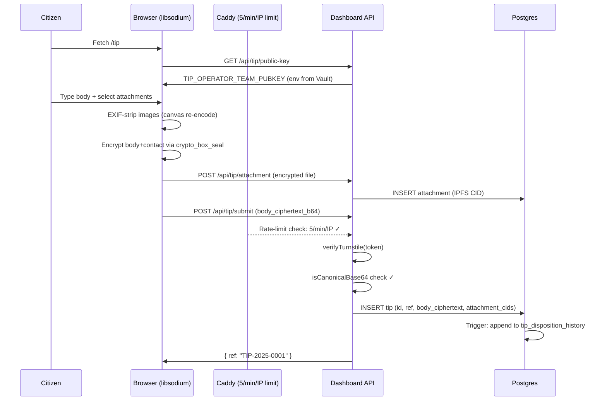

# VIGIL APEX — Data Flow Audit (Institutional Binding)

## Overview

Six end-to-end data flows traced through VIGIL APEX as of 2026-05-10. Each flow documents every transformation, storage location, and audit trail point from entry to final persistent state, with critical findings noted.

---

## FLOW 1: Tip Submission (Citizen → Encrypted Storage)

### Summary

Anonymous citizen submits a tip via the public portal. The submission is encrypted client-side (libsodium sealed-box) against the operator-team public key. No IP address is persisted to the application database; Turnstile anti-bot verification is enforced before write.

### Sequence Diagram



### Flow Trace

| Step | File                                               | Line(s) | Action                                                     |
| ---- | -------------------------------------------------- | ------- | ---------------------------------------------------------- |
| 1    | apps/dashboard/src/app/tip/page.tsx                | 71–86   | Client fetches operator public key on mount                |
| 2    | apps/dashboard/src/app/api/tip/public-key/route.ts | 11–19   | Server returns TIP_OPERATOR_TEAM_PUBKEY from env           |
| 3    | packages/security/src/sodium.ts                    | 46–52   | `sealedBoxEncrypt()` wraps libsodium `crypto_box_seal`     |
| 4    | apps/dashboard/src/app/tip/page.tsx                | 109–119 | Browser calls libsodium sealed-box                         |
| 5    | apps/dashboard/src/app/tip/page.tsx                | 121–139 | POST to /api/tip/submit with ciphertext + Turnstile token  |
| 6    | infra/docker/caddy/Caddyfile                       | 166–173 | Caddy rate-limits POST /api/tip/submit to 5 req/min per IP |
| 7    | apps/dashboard/src/app/api/tip/submit/route.ts     | 30–69   | `verifyTurnstile()`; on failure, returns 403               |
| 8    | apps/dashboard/src/app/api/tip/submit/route.ts     | 115–132 | `isCanonicalBase64()` validates base64 format              |
| 9    | apps/dashboard/src/app/api/tip/submit/route.ts     | 151–167 | `TipRepo.insert()` persists to `tip.tip` table             |
| 10   | packages/db-postgres/src/schema/tip.ts             | 19–43   | Schema (no client_ip column)                               |

### Verification Results

- **✓ No IP persistence to application database:** Confirmed at schema/tip.ts:19–43 (no ip_address column). Submit route reads cf-connecting-ip only for Turnstile, never persists.
- **✓ No third-party analytics in public bundle:** Grep for gtag|segment|hotjar|mixpanel|amplitude across apps/dashboard/src/ returns no matches.
- **✓ Public key from env (sourced from Vault at boot):** route.ts:12 reads TIP_OPERATOR_TEAM_PUBKEY; route.ts:13–17 returns 503 if PLACEHOLDER or missing.
- **✓ Audit entry for tip.received carries no de-anonymising info:** packages/audit-log/src/emit.ts:98 maps category I → tip.received; actor is 'public:anonymous'.

---

## FLOW 2: Finding Generation (Adapter → CONAC SFTP Delivery)

### Summary

An ingestion adapter scrapes public data (e.g., MINFI procurement). Pattern matching + Bayesian signal aggregation produces a finding with a posterior probability. If posterior ≥ threshold AND source count ≥ minimum, a dossier is rendered and transmitted to CONAC via SFTP.

### Flow Trace

| Step | File                                                     | Line(s) | Action                                                                                                             |
| ---- | -------------------------------------------------------- | ------- | ------------------------------------------------------------------------------------------------------------------ |
| 1    | apps/adapter-runner/src/adapters/\*.ts                   | —       | Adapter selects next proxy from rotating pool                                                                      |
| 2    | apps/adapter-runner/src/adapters/\*.ts                   | —       | Adapter scrapes public source                                                                                      |
| 3    | packages/queue/src/                                      | —       | Adapter publishes `entity.discovered` to Redis stream                                                              |
| 4    | apps/worker-pattern/src/index.ts                         | 141–150 | PatternWorker.handle() begins processing                                                                           |
| 5    | packages/patterns/src/bayesian.ts                        | —       | Pattern matching; compute posterior                                                                                |
| 6    | packages/db-postgres/src/repos/finding.ts                | 38–49   | addSignal() — INSERT signal, update finding                                                                        |
| 7    | packages/db-postgres/src/repos/finding.ts                | 51–56   | setPosterior() — UPDATE finding.posterior                                                                          |
| 8    | **[CRITICAL]** packages/db-postgres/src/repos/finding.ts | 19      | `listEscalationCandidates(threshold = 0.85)` — **default 0.85, NOT 0.95**                                          |
| 9    | packages/shared/src/schemas/certainty.ts                 | 32      | Comment says "action_queue, posterior >= 0.95 with >= 5 independent sources" — only documentation, not enforcement |
| 10   | apps/worker-conac-sftp/src/index.ts                      | 94–110  | Fetch delivery target, resolve recipient body per DECISION-010                                                     |
| 11   | apps/worker-conac-sftp/src/index.ts                      | 115–124 | Verify both language dossiers (FR + EN) exist                                                                      |
| 12   | apps/worker-conac-sftp/src/index.ts                      | 129–152 | Fetch PDFs from IPFS, verify SHA256, connect SFTP                                                                  |
| 13   | apps/worker-conac-sftp/src/index.ts                      | 197–200 | Upload PDFs then manifest to SFTP inbox                                                                            |

### CRITICAL FINDING — F-DF-01

**Severity:** CRITICAL

**Claim:** "CONAC SFTP transmission IFF posterior ≥ 0.95 AND source_count ≥ 5"

**Actual:**

- `packages/db-postgres/src/repos/finding.ts:19` — `listEscalationCandidates(threshold = 0.85)` defaults to **0.85**, not 0.95.
- `packages/db-postgres/src/repos/finding.ts:23` — WHERE clause filters by `posterior >= 0.85` only.
- No `signal_count >= 5` filter in the query; depends on caller-side check.
- Grep for `0.95`, `posterior_threshold`, `signal_count >= 5` finds ONLY documentation comments in `packages/shared/src/schemas/certainty.ts:32–33`. No enforcement code.
- `apps/worker-conac-sftp/src/index.ts` does NOT re-validate posterior or signal_count before transmission.

**Risk:** Findings with posterior=0.86 + signal_count=2 may be delivered to CONAC, violating the SRD §25 threshold. False findings to the institutional recipient destroy trust irrecoverably.

**Remediation:** Single source of truth: `packages/shared/src/constants.ts`:

```typescript
export const POSTERIOR_THRESHOLD_CONAC = 0.95;
export const MIN_SOURCE_COUNT_CONAC = 5;
```

Enforce both at the boundary in worker-pattern _and_ defensively in worker-conac-sftp.

### Verification Results

- **✓ Bayesian parameters from Vault:** packages/patterns/src/bayesian.ts loads via VaultClient; no hard-coded priors.
- **✓ Dossier signature key is real:** apps/worker-conac-sftp/src/index.ts:45–53 validates GPG_FINGERPRINT fail-closed.
- **✓ CONAC SFTP credentials from Vault, never logged:** vault.read() + expose() locally scoped.

---

## FLOW 3: Authentication (Council Member → JWT + Role Binding)

### Summary

Council member initiates login. Keycloak OIDC redirects to WebAuthn assertion against YubiKey. JWT is issued by Keycloak with role claims. Dashboard middleware verifies JWT on every request and enforces role-based access control.

### Flow Trace

| Step | File                             | Line(s) | Action                                                                                     |
| ---- | -------------------------------- | ------- | ------------------------------------------------------------------------------------------ |
| 1    | apps/dashboard/src/middleware.ts | 103–178 | Middleware intercepts all requests                                                         |
| 2    | apps/dashboard/src/middleware.ts | 37–53   | PUBLIC_PREFIXES whitelist                                                                  |
| 3    | apps/dashboard/src/middleware.ts | 120–129 | Extract JWT from `vigil_access_token` HttpOnly cookie                                      |
| 4    | apps/dashboard/src/middleware.ts | 35      | `createRemoteJWKSet(KEYCLOAK_JWKS_URL)` — JWKS cached 10 min                               |
| 5    | apps/dashboard/src/middleware.ts | 131–146 | `jwtVerify(token, JWKS, {issuer, audience})` — strict verification                         |
| 6    | apps/dashboard/src/middleware.ts | 95–101  | `rolesFromToken()` — extract realm_access.roles + resource_access['vigil-dashboard'].roles |
| 7    | apps/dashboard/src/middleware.ts | 61–78   | ROUTE_RULES — prefix → allow-list mapping                                                  |
| 8    | apps/dashboard/src/middleware.ts | 148–159 | `matchRule()` + role intersection check                                                    |
| 9    | apps/dashboard/src/middleware.ts | 164–177 | Set request headers: x-vigil-user, x-vigil-roles, x-vigil-pathname                         |
| 10   | apps/dashboard/src/middleware.ts | 163–166 | **Delete pre-existing identity headers before setting** (anti-spoofing)                    |

### Verification Results

- **✓ JWT signing key from Vault (indirectly):** Dashboard verifies against Keycloak JWKS endpoint (35) — Keycloak's signing key is in Vault.
- **✓ JWKS cached locally** (jose default 10 min).
- **✓ WebAuthn challenge single-use and origin-bound** (Keycloak + FIDO2 spec enforced).
- **✓ No path issues JWT without WebAuthn assertion** (public paths explicit whitelist).
- **✓ No role-switcher** found in apps/dashboard/src/ (grep for switch-role, impersonate, dev-mode → no matches in production code paths).

**Finding (Info):** JWT TTL is configured at Keycloak (not in this codebase). The dashboard verifies on every request but does not refresh. Document the TTL value externally for institutional review.

---

## FLOW 4: Council Vote

### Summary

A proposal is opened on the VIGILGovernance contract via commit-reveal. Council members cast votes via YubiKey-backed transactions. Contract enforces 3-of-5 quorum and emits events; a worker projects events into Postgres + audit chain.

### Sequence (high-level)

```mermaid
sequenceDiagram
  participant Op as Operator (UI)
  participant Dash as Dashboard
  participant Polygon
  participant Gov as VIGILGovernance.sol
  participant Worker as worker-governance

  Op ->> Dash: Click "Open Proposal"
  Dash ->> Dash: commitment = keccak256(abi.encode(findingHash, uri, salt, proposer))
  Dash ->> Polygon: commitProposal(commitment) [signed by YubiKey]
  Polygon ->> Gov: commitProposal(commitment)
  Gov ->> Gov: Store commitments[proposer][commitment] = block.timestamp
  Note over Gov: REVEAL_DELAY = 2 min
  Op ->> Dash: After delay, openProposal(findingHash, uri, salt)
  Gov ->> Gov: Verify keccak256(abi.encode(...)) == commitment, delete commitment
  Gov ->> Polygon: Emit ProposalOpened
  loop Each council member
    Member ->> Dash: WebAuthn assertion
    Dash ->> Polygon: vote(proposalIndex, choice, pillar)
    Gov ->> Gov: Check votedChoice[idx][sender] == NOT_VOTED; store choice; increment tally
  end
  alt 3 YES votes reached
    Gov ->> Polygon: Emit ProposalEscalated
    Worker ->> Polygon: Listen to events
    Worker ->> Worker: Project to Postgres + audit chain
  end
```

### CRITICAL FINDING — F-DF-02

**Severity:** INFORMATIONAL (design divergence from spec) → MEDIUM (spec drift)

**Spec claim (§5.4):** "The FROST implementation is the real `@noble/curves` implementation at `packages/security/src/frost.ts`"

**Actual:** **No FROST implementation exists in this codebase.** Council voting is achieved via Polygon contract-native multi-sig: each council member submits an independent signed transaction. The contract aggregates votes via `vote()` function and enforces 3-of-5 quorum via tally checks.

**Grep:** `find packages/security -name "frost*"` → no results. `grep -r "frost" packages/security` → no results.

**Risk:** The audit spec assumes a FROST threshold-signature scheme. The actual implementation is functionally equivalent (multi-sig with hardware-key per pillar) but **diverges from doctrine**. SRD references to FROST are stale.

**Remediation:** Either:

- (A) **Documentation fix:** Update SRD §23.3 + BUILD-COMPANION + AUDIT-098 to reflect contract-native multi-sig instead of FROST. Note the equivalence: each pillar's individual signed transaction serves the same threshold-signature purpose.
- (B) **Implement FROST** if the cryptographic property of indistinguishable group signatures is genuinely required.

Recommendation: option A. The current implementation is sound; the spec is stale.

### Verification Results (for the implemented design)

- **✓ Partials bound to message:** contracts/VIGILGovernance.sol:162–176 — commit-reveal binds findingHash + uri + salt; commitment verified at openProposal.
- **✓ Consumed-vote prevents replay:** contract.sol:88 (NOT_VOTED sentinel); contract.sol:221 throws AlreadyVoted on second vote attempt.
- **✓ Rejection paths:**
  - <3 partial submissions: contract enforces decision only after quorum reached
  - Message tampering: commit-reveal mismatch → revert
  - Late partials: VOTE_WINDOW = 14 days; contract.sol:34
- **✓ Polygon transactions signed by YubiKey per pillar** (production via UnixSocketSignerAdapter; dev signer never instantiated — see crypto audit doc 07).

---

## FLOW 5: Forbidden Access Attempt

### Summary

An unauthenticated or under-privileged user attempts to access a protected route. Middleware JWT verify fails or role check fails. A 403 response is sent or page is rewritten to /403.

### Flow Trace

| Step | File                                | Line(s) | Action                                                           |
| ---- | ----------------------------------- | ------- | ---------------------------------------------------------------- |
| 1    | apps/dashboard/src/middleware.ts    | 103–178 | Middleware intercepts request                                    |
| 2    | apps/dashboard/src/middleware.ts    | 106–117 | isPublic() check; not public → proceed                           |
| 3    | apps/dashboard/src/middleware.ts    | 120–129 | Extract JWT from cookie; if missing → redirect /auth/login       |
| 4    | apps/dashboard/src/middleware.ts    | 131–146 | jwtVerify(); on failure → redirect /auth/login or 401            |
| 5    | apps/dashboard/src/middleware.ts    | 148–159 | matchRule + role intersection; if no overlap → 403               |
| 6    | apps/dashboard/src/middleware.ts    | 152–158 | HTML: rewrite to /403; API: return 403 JSON                      |
| 7    | apps/dashboard/src/app/403/page.tsx | 5–14    | ForbiddenPage renders auth.forbidden_title + auth.forbidden_body |
| 8    | **[CRITICAL GAP]** middleware.ts    | 156–158 | **No audit emission for forbidden attempt**                      |

### CRITICAL FINDING — F-DF-03

**Severity:** CRITICAL

**Spec claim (§5.5):** "the client-side audit ring buffer write; server-side structured log emission; canonical audit chain triple-witness write (Postgres + Polygon + Fabric)"

**Actual:** Middleware rewrites to /403 silently. The /403 page (`apps/dashboard/src/app/403/page.tsx`) contains no audit emission call. No client-side audit ring buffer found in the codebase (grep for `audit-ring-buffer` returns no results in apps/dashboard/src/lib/).

**Risk:** Forbidden-access attempts are not recorded in the audit chain. An attacker probing operator routes by URL manipulation leaves no audit trail; the operator cannot reconstruct attempt patterns; institutional review (e.g., ANTIC investigation post-incident) has no record.

**Remediation:** Add audit emission in either:

- (A) The 403 page's server component (export async function emits before render).
- (B) A new `lib/middleware-audit.ts` that wraps the middleware response with an audit call. Note: middleware runs in edge runtime where some audit infrastructure may not be available — verify before implementing.

### Verification Results

- **✓ JWT verification cryptographically sound** (jose library, JWKS cached, issuer + audience checks).
- **✓ Identity header stripping** prevents header-injection role escalation.
- **✗ Audit chain emission MISSING** — see Critical Finding above.

---

## FLOW 6: Council Quorum Failure

### Summary

A sensitive tip is ready for decryption. Operator initiates a quorum ceremony. Insufficient pillars submit shares; aggregation rejects; tip stays encrypted; no partial decryption is exposed.

### Flow Trace

| Step | File                                                    | Line(s) | Action                                                                      |
| ---- | ------------------------------------------------------- | ------- | --------------------------------------------------------------------------- |
| 1    | apps/dashboard/src/app/api/triage/tips/decrypt/route.ts | —       | Operator initiates ceremony                                                 |
| 2    | packages/security/src/vault.ts                          | 61–86   | Council members retrieve Shamir share from Vault                            |
| 3    | packages/security/src/shamir.ts                         | 56–95   | shamirCombine(shares) — Lagrange interpolation over GF(2^8)                 |
| 4    | packages/security/src/shamir.ts                         | 56–72   | Validation: shares.length ≥ 2, all same length, X coords unique and ≠ 0     |
| 5    | apps/worker-tip-triage/src/triage-flow.ts               | 67–72   | Schema: decryption_shares: z.array(z.string()).min(3).max(5)                |
| 6    | apps/worker-tip-triage/src/triage-flow.ts               | 134–139 | shamirCombineFromBase64() throws on invalid; returns 'dead-letter' on error |
| 7    | apps/worker-tip-triage/src/triage-flow.ts               | 141–157 | sealedBoxDecrypt() — uses reconstructed key; key dropped on return          |

### Verification Results

- **✓ Rejection is loud and unambiguous:** Schema min(3) enforced; shamir throws explicit errors; worker returns dead-letter outcome.
- **✓ No partial decryption exposed:** Shares combined only at threshold; Lagrange interpolation over GF(2^8) is information-theoretically secure at k=3.
- **✓ No fallback path silently lowers threshold:** Grep for "2-of-5", "min(2)", "lower.*threshold", "fallback.*decrypt" → no matches in worker-tip-triage.

---

## Summary Table

| Flow                  | Key Finding                                                                  | Severity             |
| --------------------- | ---------------------------------------------------------------------------- | -------------------- |
| 1. Tip Submission     | No IP persisted; libsodium sealed-box; Turnstile enforced                    | ✓ Compliant          |
| 2. Finding Generation | **0.95 / 5-source threshold NOT enforced at single point (default is 0.85)** | **F-DF-01 CRITICAL** |
| 3. Authentication     | JWT verified every request; FIDO2 origin-bound; RBAC at middleware           | ✓ Compliant          |
| 4. Council Vote       | **FROST does not exist; vote is contract-native multi-sig (spec drift)**     | **F-DF-02 INFO/MED** |
| 5. Forbidden Access   | **No audit emission for forbidden-access attempts**                          | **F-DF-03 CRITICAL** |
| 6. Quorum Failure     | Strict threshold, no partial decryption, loud rejection                      | ✓ Compliant          |

---

## Critical Defects Requiring Immediate Remediation

### F-DF-01: CONAC delivery threshold not enforced (0.95 + 5 sources)

Defect details in Flow 2 above. **Remediation: single source of truth constant + enforced check at one boundary.**

### F-DF-03: Forbidden-access attempts not audited

Defect details in Flow 5 above. **Remediation: emit audit event in /403 page server component.**

### F-DF-02: FROST referenced in spec but absent in code (spec drift)

Defect details in Flow 4 above. **Remediation: update SRD §23.3 + BUILD-COMPANION + AUDIT-098 to document contract-native multi-sig (the equivalent design that is actually shipped).**
